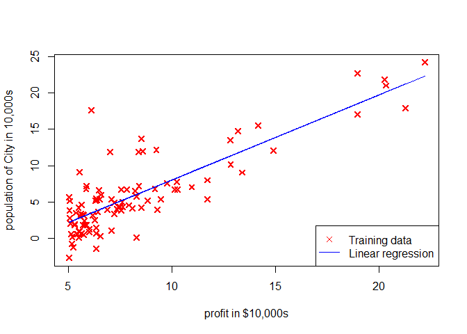
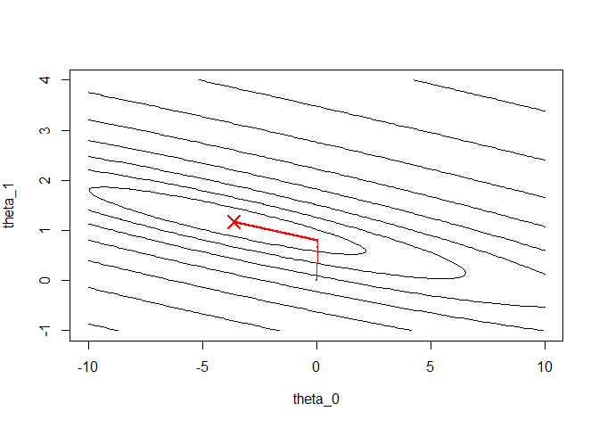

1. Linear regression with one variable
======================================

### 1.1 Plotting the Data

``` r
data = read.table("ex1data1.txt", sep = ',')
X_1 = data[, 1]
y = data[, 2]
m = length(y) # number of training examples

plotData = function (x, y) {
  plot(
    x, y, col = "red", pch = 4, cex = 1.1, lwd = 2,
    xlab = 'profit in $10,000s',
    ylab = 'population of City in 10,000s'
  )
}
plotData(X_1, y) # using plotData function
```


### 1.2 Gradient descent

#### 1.2.1 Settings

``` r
X = cbind(rep(1, m), X_1)
X = as.matrix(X) # from data.frame to matrix

theta = c(0, 0) # initializing fitting parameters

iterations = 1500
alpha = 0.01
```

#### 1.2.2 Computing the cost J(theta)

``` r
computeCost = function(X, y, theta) {
  J = 0 
  m = length(y)
    
  h_x = X %*% theta
  res = h_x - y
  J = (t(res) %*% res) / (2 * m)
  J
}

# print result to screen
sprintf('Cost J: %.3f', computeCost(X, y, theta))
```

    ## [1] "Cost J: 32.073"

#### 1.2.3 Setting Gradient descent algorithm

``` r
gradientDescent = function(X, y, theta, alpha, num_iters) {
  m = length(y)
  J_history = rep(0, num_iters + 1) # making room for saving J
  theta_history = matrix(0, num_iters + 1, length(theta)) # making room for saving theta
  theta_history[1, ] = t(theta) # saving initial vlaue to matrix
  J_history[1] = computeCost(X, y, theta) # saving initial vlaue to matrix
  
  for (i in 2 : (num_iters + 1)) {
    
    theta_prev = theta # create a copy of theta for simultaneous update
    
    # simultaneous update theta using theta_prev, using vectorized method
    
    deriv_J = (t(X) %*% ((X%*% theta_prev) - y)) / m
    theta = theta - (alpha * deriv_J)
    
    # updating J_history and theta_history
    
    J_history[i] = computeCost(X, y, theta)
    theta_history[i, ] = t(theta)
  }
  
  list(theta = theta, J_history = J_history, theta_history = theta_history)
}
```

#### 1.2.4 Run Gradient descent algorithm

``` r
gd = gradientDescent(X, y, theta, alpha, iterations)

# Saving results from list variables into global env variables
theta = gd$theta
J_history = gd$J_history
theta_history = gd$theta_history
rm(gd) # remove gd

# print theta to screen
sprintf('Theta found by gradient descent: %.3f %.3f', theta[1], theta[2])
```

    ## [1] "Theta found by gradient descent: -3.630 1.166"

``` r
# check whether gradient descent worked correctly 
n_iter = c(0:iterations)
plot(n_iter, J_history, xlab = 'n of iterations', ylab = 'Cost J',
     ylim = c(4, 7), cex = 0.1, col = "blue")
```


``` r
# plot the linear fit
# keep previous plot visible
plotData(X_1, y) # using plotData function
lines(X[, 2], X %*% theta, col = "blue")
legend("bottomright", c('Training data', 'Linear regression'), pch=c(4,NA),col=c("red","blue"), lty=c(NA,1) )
```



``` r
# Predict values for population sizes of 35,000 and 70,000
predict1 = c(1, 3.5) %*% theta
sprintf('For population = 35,000, we predict a profit of %f',predict1*10000)
```

    ## [1] "For population = 35,000, we predict a profit of 4519.767868"

``` r
predict2 <- c(1, 7) %*% theta
sprintf('For population = 70,000, we predict a profit of %f',predict2*10000)
```

    ## [1] "For population = 70,000, we predict a profit of 45342.450129"

### 1.3 Visualization

#### 1.3.1 Visualizing J(theta\_0, theta\_1), Contour

``` r
# Grid over which we will calculate J
theta0_vals = seq(-10, 10, length.out = 100)
theta1_vals = seq(-1, 4, length.out = 100)

# initialize J_vals to a matrix of 0's
J_vals = matrix(0, length(theta0_vals), length(theta1_vals))

# Fill out J_vals
for (i in 1 : length(theta0_vals)) {
  for (j in 1 : length(theta1_vals)) {
    J_vals[i, j] = computeCost(X, y, c(theta0_vals[i], theta1_vals[j]))
  }
}


# plot J-vals as 20 countours spaced logarithmically between 0.01 and 100
# logarithmic contours are denser near the center

logspace = function(d1, d2, n) {
  return(exp(log(10) * seq(d1, d2, length.out = n)))
}

contour(theta0_vals, theta1_vals, J_vals, levels = logspace(-2, 3, 20),
        xlab = expression(theta_0),
        ylab = expression(theta_1),
        drawlabels = FALSE)

points(theta[1], theta[2], pch = 4, cex = 2, col = "red", lwd =2)
points(theta_history[, 1], theta_history[, 2], col = "red", cex = 0.2, lwd = 1, pch =19)
lines(theta_history[, 1], theta_history[, 2], col = "red")
```


