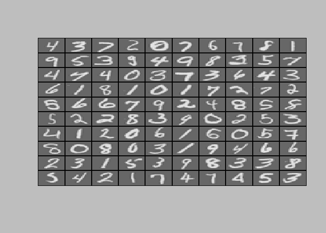

Neural Networks Learning
================

In this exercise, we will implement the backpropagation algorithm to learn the parameters for the neural network.

1.Neural Networks
=================

### 1.1 Visualizing the data

#### 1.1.1 Data loading

``` r
library(rmatio) # library for loading matlab file
```

    ## Warning: package 'rmatio' was built under R version 3.4.4

``` r
data = read.mat("C:/Users/user/Documents/Basic-ML-with_R/data/ex4data1.mat")
list2env(data, .GlobalEnv)
```

    ## <environment: R_GlobalEnv>

``` r
rm(data)
m = dim(X)[1]

# Suppressing warning message
options(warn = -1)
```

#### 1.1.2 Display

Using 'displayData' function from previous exercise

``` r
# Function loading
source("C:/Users/user/Documents/Basic-ML-with_R/function/displayData.R")

# Randomly select 100 data points to display
rand_indices = sample(m)
sel = X[rand_indices[1:100], ]

# Displaying randomly selected data
displayData(sel)
```



### 1.2 Model representation

Our neural network has 3 layers- input layer(400 units), a hidden layer(25 units) and ouput layer(10 units).

``` r
# setup initial networks parameters
s_input = 400
s_hidden = 25
s_output = 10
```

### 1.3 Feed forward and cost function

We implement the cost function for the neural network. Use nnCostFunction to compute cost J.

``` r
# Parameters loading
theta = read.mat("C:/Users/user/Documents/Basic-ML-with_R/data/ex4weights.mat")
list2env(theta, .GlobalEnv)
```

    ## <environment: R_GlobalEnv>

``` r
# Unroll parameters to implement forward & back propagation
theta = c(c(Theta1), c(Theta2)) 
```

Write 'nncosfuncton' to compute Cost J

``` r
source("C:/Users/user/Documents/Basic-ML-with_R/function/sigmoid.R")
nnCostFunction = function(X, y, s_input, s_hidden, s_output, lambda) {
  
  function(nn_parameters) {
    # Reshape nn_parameters into parameters such as Theta1, Theta2, Theta3..
    # In this case, our network has 2 layers then we need Theta, Theta2
    Theta1 = matrix(nn_parameters[1 : (s_hidden * (s_input + 1))], 
                    s_hidden, (s_input + 1))
    
    Theta2 = matrix(nn_parameters[(s_hidden * (s_input + 1)) + 1 :
                                  length(nn_parameters)], s_output, 
                    (s_hidden + 1))
    
    # useful variable
    m = dim(X)[1]
    
    # transform y to matrix Y 
    Y = matrix(0, s_output, m) # 10 by 5000
    for (i in 1 : m) {
      Y[y[i], i] = 1 
    }
  
    # Forward propagation
    X = cbind(c(rep(1, m)), X) # add bias unit
    a1 = t(X) # 401 by 5000
    z2 = Theta1 %*% a1 # 25 by 5000
    a2 = rbind(c(rep(1, m)), sigmoid(z2)) # 26 by 5000
    z3 = Theta2 %*% a2 # 10 by 5000
    a3 = sigmoid(z3) # h_theta(X), 10 by 5000
    h = a3
    
    # Compute Cost J
    J = sum((log(h) * Y) + (log(1-h) * (1-Y))) / -m 
    # '*' operates elementwise multiply 
    reg_term = sum(Theta1[, -1]^2) + sum(Theta2[, -1]^2)  
    J = J + (reg_term * (lambda / (2*m)))  # add regularization term
    
  }
  
}
```

Compute Cost J using nncostfunction with given Thetha

``` r
# Forward propagation without regularization
lambda = 0
cost_J = nnCostFunction(X, y, s_input, s_hidden, s_output,lambda)(theta)

sprintf('Cost J without regularization: %.6f', cost_J)
```

    ## [1] "Cost J without regularization: 0.287629"

``` r
# Forward propagation with regularization
lambda = 1
cost_J = nnCostFunction(X, y, s_input, s_hidden, s_output,lambda)(theta)

sprintf('Cost J with regularization: %.6f', cost_J)
```

    ## [1] "Cost J with regularization: 0.383770"

2.BackPropagation
=================

In this part of the exercise, we will implement the backpropagation algorithm to compute the gradient for the neural network cost function.

### 2.1 Random initialization

When training neural networks, it is important to randomly initialize the parameters for symmetry breaking.

Here, we use 'randInitializeWeights' function to randomly select values for theta matrix uniformly in the range \[-0.12, 0.12\]. This range of values ensures that the parameters are kept small and makes the learning more efficient.

Write theta initialization function

``` r
randInitializeWeights = function(s_input, s_output) {
  n_element = (s_input + 1) * s_output
  
# 'runif' provides uniform distribution number
  W = matrix(runif(n_element, 0, 1), nrow = s_output) 
  epsilon_init = 0.12
  W = (W * (2 * epsilon_init)) - epsilon_init
  W
}
```

Make initial Theta

``` r
initial_Theta1 = randInitializeWeights(s_input, s_hidden)
initial_Theta2 = randInitializeWeights(s_hidden, s_output)

# Unroll initial Theta
initial_Theta = c(c(initial_Theta1), c(initial_Theta2))
```

### 2.2 Implement backpropagation

Implementing backpropagation algorithm to compute gradient with following steps.

1.  Perform forward propagation to compute a(l) with initial theta and X.
2.  Using y, compute 'error term' delta(l)(l = 2, 3, ...L) that measures how much that node was responsible for any errors in our output.
3.  Update gradient using delta(l) and a(l)
4.  Implement step 1 to 3 in a loop that processes one example at a time.
5.  Divide accumulated gradients by size of samples.
6.  Add regularization term.

Write backpropagation function

``` r
backPropagation = function(X, y, s_input, s_hidden, s_output, lambda) {
  function(nn_parameters) {
    
    # Reshape nn_parameters into parameters such as Theta1, Theta2, Theta3...
    # In this exercise, our network has 2 layers then we need Theta1, Theta2
    Theta1 = matrix(nn_parameters[1 : (s_hidden * (s_input + 1))], 
                    s_hidden, (s_input + 1))
    
    Theta2 = matrix(nn_parameters[(s_hidden * (s_input + 1)) + 1 :
                                    length(nn_parameters)], s_output, 
                    (s_hidden + 1))
    # useful variable
    m = dim(X)[1]
    
    # transform y to matrix Y
    Y = matrix(0, s_output, m) # 10 by 5000
    for (i in 1:m) {
      Y[y[i], i] = 1
    }
    
    # Forward propagation
    X = cbind(c(rep(1, m)), X) # add bias unit
    a1 = t(X) # 401 by 5000
    z2 = Theta1 %*% a1 # 25 by 5000
    a2 = rbind(c(rep(1, m)), sigmoid(z2)) # 26 by 5000
    z3 = Theta2 %*% a2 # 10 by 5000
    a3 = sigmoid(z3) # h_theta(X), 10 by 5000
    h = a3
    
    
    # Compute deltas
    delta_L = h - Y # 10 by 5000
    delta_2 = (t(Theta2) %*% delta_L) * a2 * (1 - a2) 
    # 26 by 5000, using matrix form
    
    # Compute gradient matrix for Theta1 and Theta2
    grad2 = (delta_L %*% t(a2)) / m  # 10 by 26 
    grad1 = (delta_2[-1, ] %*% t(a1)) / m  
    # note that we should remove 1st row of delta_2, then dimension of grad1
    # should be 25 by 401
    
    
    # Add regularization term
    # note that we should not regularize the first column for each Theta. 
    grad2 = grad2 + ((lambda / m) * cbind(c(rep(0, dim(Theta2)[1])),
                                          Theta2[, -1]))
    grad1 = grad1 + ((lambda / m) * cbind(c(rep(0, dim(Theta1)[1])),
                                          Theta1[, -1]))
    
    
    # Unroll gradients
    grad = c(c(grad1), c(grad2)) 
    grad
    
  }
}
```

### 2.3 Training neural networks

In this part, we use 'lbfgsb3\_' function for optimization (Special thanks to github.com/faridcher)

``` r
# setting lambda
lambda = 1

# Load lbfgsb3 library and lbfgsb3_ function
library(lbfgsb3)
```

    ## Loading required package: numDeriv

``` r
source("C:/Users/user/Documents/Basic-ML-with_R/function/lbfgsb3_.R")


# Set cost J and gradient first to make costfunction and gradfunction
# be functions that take in only one argument(Initial_Theta)

cost = nnCostFunction(X, y, s_input, s_hidden, s_output, lambda) 
# over Initial_Theta

grad = backPropagation(X, y, s_input, s_hidden, s_output, lambda) 
# over Initial_Theta

# Optimization
optimRes = lbfgsb3_(initial_Theta, fn = cost, gr = grad,
                      control = list(trace = 1, maxit = 50)) 
```

    ## This problem is unconstrained.
    ## At iteration  0  f = 7.104293
    ## At iteration  2  f = 4.539791
    ## At iteration  3  f = 3.259254
    ## At iteration  4  f = 3.248918
    ## At iteration  5  f = 3.23784
    ## At iteration  6  f = 3.200506
    ## At iteration  7  f = 3.10629
    ## At iteration  8  f = 2.967763
    ## At iteration  9  f = 2.707767
    ## At iteration  10  f = 2.386467
    ## At iteration  11  f = 2.091548
    ## At iteration  12  f = 1.993548
    ## At iteration  13  f = 1.605859
    ## At iteration  14  f = 1.458708
    ## At iteration  15  f = 1.367701
    ## At iteration  16  f = 1.275971
    ## At iteration  17  f = 1.213982
    ## At iteration  18  f = 1.108767
    ## At iteration  19  f = 1.031999
    ## At iteration  20  f = 0.9575504
    ## At iteration  21  f = 0.9037644
    ## At iteration  22  f = 0.8524372
    ## At iteration  23  f = 0.808259
    ## At iteration  24  f = 0.7725692
    ## At iteration  25  f = 0.7397652
    ## At iteration  26  f = 0.7056675
    ## At iteration  27  f = 0.6736121
    ## At iteration  28  f = 0.6578546
    ## At iteration  29  f = 0.6437494
    ## At iteration  30  f = 0.6333403
    ## At iteration  31  f = 0.620184
    ## At iteration  32  f = 0.5993106
    ## At iteration  33  f = 0.5799055
    ## At iteration  34  f = 0.5688968
    ## At iteration  35  f = 0.5536555
    ## At iteration  36  f = 0.546476
    ## At iteration  37  f = 0.5380536
    ## At iteration  38  f = 0.527543
    ## At iteration  39  f = 0.520253
    ## At iteration  40  f = 0.5122693
    ## At iteration  41  f = 0.4994855
    ## At iteration  42  f = 0.49519
    ## At iteration  43  f = 0.4864901
    ## At iteration  44  f = 0.4847197
    ## At iteration  45  f = 0.4745508
    ## At iteration  46  f = 0.4709927
    ## At iteration  47  f = 0.4666307
    ## At iteration  48  f = 0.4612564
    ## At iteration  49  f = 0.4556317
    ## At iteration  50  f = 0.4513274
    ## At iteration  51  f = 0.4446493

We can see Cost J decreasing as iteration goes

``` r
# Saving results
optim_param = optimRes$prm

# Get Theta1 and Theta2 from optim_param
Theta1 = matrix(optim_param[1 : (s_hidden * (s_input + 1))], 
                s_hidden, (s_input + 1))

Theta2 = matrix(optim_param[(s_hidden * (s_input + 1)) + 1 :
                              length(optim_param)], s_output,(s_hidden + 1))
```

Make prediction using 'predict\_w\_nn' function in previous exercise.

``` r
# Load predict_w_nn function
source("C:/Users/user/Documents/Basic-ML-with_R/function/predict_w_nn.R")

prediction = predict_w_nn(Theta1, Theta2, X) 

# saving result
pred = prediction$pred

# Print accuracy
sprintf('Training set accuracy: %.3f', mean(pred == y))
```

    ## [1] "Training set accuracy: 0.969"

To give you an idea of the network's output, you can also run through the examples one at the time to see what it is predicting.

``` r
# Choose random number in 1:5000
i = sample(1:5000, 1)

# Display
displayData(X[i, ])
```


``` r
# Predicting for i-th element in sample and compare it to i-th element of y   
pred = predict_w_nn(Theta1, Theta2, X[i, ])$pred
sprintf('Neural Network prediction:%d (when y = %d)', pred, y[i])
```

    ## [1] "Neural Network prediction:2 (when y = 2)"

### 2.4 Visualizaing the hidden layer

Visualizing what the representations captured by the hidden units is one way to understand what our neural network is learning.

For the neural network we trained, notice that the i-th row of theta\_1 is a 401-dimensional vector that represents the parameter for the i-th row of hidden unit.

If we discard the bias term, we get a 400 dimensional vector that represents the weights from each input pixel to the hidden unit.

Thus, one way to visualize the representation captured by the hidden unit is to reshape this 400 dimensional vector into a 20 by 20 image and display it.

``` r
# Display Theta1 without first column

displayData(Theta1[, -1])
```


