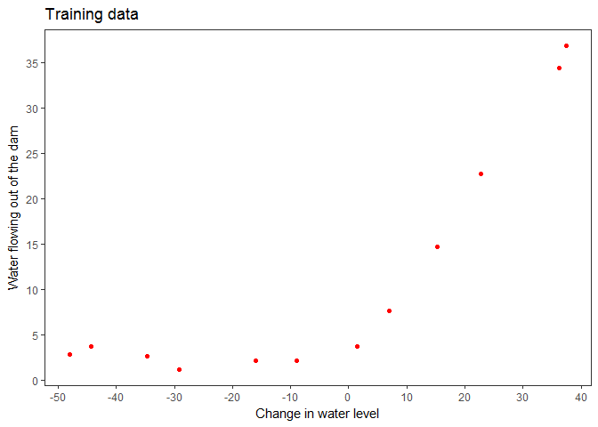

Regularized linear regression and Bias v.s. Variance
================

In this exercise, we will implement regularized linear regression and use it to study models with different bias-variance properties.

1.Regularized linear regression
===============================

### 1.1 Visualizing the dataset

#### 1.1.1 Data loading

``` r
# Suppressing warning message
options(warn = -1)

library(rmatio) # library for loading matlab file
data = read.mat("C:/Users/user/Documents/Basic-ML-with_R/data/ex5data1.mat")
list2env(data, .GlobalEnv)
```

    ## <environment: R_GlobalEnv>

``` r
rm(data)
# A training set that our model will learn on: X, y
# A cross validation set for determining the regularization parameter:
# Xval, yval
# A test set for evaluating performance: Xtest, ytest
```

#### 1.1.2 Display

Using 'ggplot2' function to display

``` r
library(ggplot2)

# We should note that ggplot2 only works with data.frame
data_train = as.data.frame(cbind(X,y))

# Create plot p
p = ggplot(data_train, aes(X, y)) + geom_point(color = 'red') + 
  xlab("Change in water level") + ylab("Water flowing out of the dam") +
  scale_x_continuous(breaks = seq(-50, 40, 10)) + 
  scale_y_continuous(breaks = seq(0, 40, 5)) + theme_bw() +
  ggtitle("Training data") +
  theme(legend.title = element_blank(), panel.grid.major.x = element_blank() ,
        panel.grid.minor.y = element_blank(),
        panel.grid.major.y = element_blank(),
        panel.grid.minor.x = element_blank())

# Show plot p
p  
```



### 1.2 Regularized linear regression cost function

Make 'computeCost' function to compute Cost\_J

``` r
computeCost = function(X, y, theta, lambda) {
  J = 0 
  m = length(y)
  h_x = X %*% theta
  res = h_x - y
  J = (t(res) %*% res) / (2 * m)
  reg_term = t(theta[-1]) %*% theta[-1] * (lambda / (2 * m))
  J = J + reg_term
  J
}
```

Initial settings

``` r
initial_theta = c(1, 1)
lambda = 1
```

Compute cost\_J for trainin data with initial settings

``` r
cost_J = computeCost(cbind(c(rep(1, length(X))), X), y , initial_theta, lambda)
sprintf('Cost J: %.3f', cost_J)
```

    ## [1] "Cost J: 303.993"
