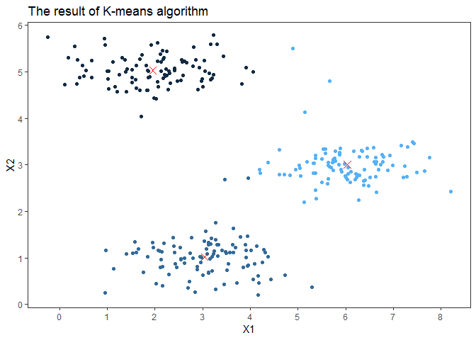

K-means Clustering and PCA
================

In this exercise, we will implement the K-means clustering algorithm and apply it to compress an image.

In the second part, we will use principal component analysis to find a low-dimensional representation of face images.

1.K-means Clustering
====================

### 1.1 Implementing K-means

#### 1.1.1 Data loading

``` r
# Suppressing warning message
options(warn = -1)

# library for loading matlab file
library(rmatio) 
data = read.mat("C:/Users/user/Documents/Basic-ML-with_R/data/ex7data2.mat")
list2env(data, .GlobalEnv)
```

    ## <environment: R_GlobalEnv>

``` r
rm(data)
```

#### 1.1.2 Finding closest centroids

Using 'findClosestCentroids' function, we assigns every training examples x(i) to its closest centroid, given the current positions.

``` r
findClosestCentroids = function(X, centroids) {
  
  m = dim(X)[1]
  c = rep(0, m)
  k = dim(centroids)[1]
  
  for (i in 1:m){
    # Calculate distances between sample x and each centroid
    X_i_matrix = rep(1, k) %*% t(X[i, ])
    diff = X_i_matrix - centroids # K by n, where n is the dimension of X
    diff_2 = diff^2
    distance = apply(diff_2, 1, sum) 
    # Assign every training example to closest centroid's index
    c[i] = which.min(distance)
  }
  # return c
  c
}
```

#### 1.1.3 Computing centroid means

Using 'computeCentroids' function, we recomputes, for each centroid, the mean of the points that were assigned to it.

``` r
computeCentroids = function(X, idx, K){
  
  n = dim(X)[2]
  centroids = matrix(0, nrow = K, ncol = n)
    
  for (i in 1:K){
    centroids[i, ] = apply(X[which(idx == i), ], 2, mean)
  }
  centroids
}
```

#### 1.1.4 K-means on example dataset

We use 'runKmeans' function to implement K-means algorithm with iterations.

``` r
ini_cen = matrix(c(3, 3, 6, 2, 8, 5), nrow = 3, byrow = TRUE)
max_iter = 10
```

Make 'runKmeans' function first

``` r
runKmeans = function(X, init_centroids, max_iter){
  
  # Settings
  m = dim(X)[1]
  n = dim(X)[2]
  K = dim(init_centroids)[1]
  
  previous_centroids = array(0, dim = c(dim(init_centroids), max_iter +1))
  previous_centroids[, , 1] = init_centroids
  
  # Run K-means algorithm with iterations 
  for (i in 1:max_iter){
    idx = findClosestCentroids(X, previous_centroids[, , i])
    previous_centroids[, , i + 1] = computeCentroids(X, idx, K)
  }
  list(centroids = previous_centroids[, , max_iter + 1], idx = idx)
}
```

Run K-means algorithm

``` r
K_means_algorithm = runKmeans(X, ini_cen, 10)

# Save results
centroids = K_means_algorithm$centroids
idx = K_means_algorithm$idx
```

Visualize the results

``` r
# Convert matrix to data.frame first
data_plot = data.frame(X, idx)
centroids_plot = as.data.frame(centroids)

# Create plot
library(ggplot2)
p = ggplot(data_plot, aes(X1, X2), color = idx) + geom_point(aes(color = idx))+
  geom_point(data = centroids_plot, aes(V1, V2), color = 'red', pch = 4,
             size = 3, lwd = 2) +
  ylab("X2") + xlab("X1") +
  scale_x_continuous(breaks = seq(-1, 9, 1)) +
  scale_y_continuous(breaks = seq(0, 6, 1)) +
  theme_bw() + ggtitle("The result of K-means algorithm") +
  theme(legend.title = element_blank(), 
        panel.grid.major.x =element_blank(),
        panel.grid.minor.y = element_blank(),  
        panel.grid.minor.x = element_blank(), 
        panel.grid.major.y = element_blank()) +
  theme(legend.position = 'none')
p
```


