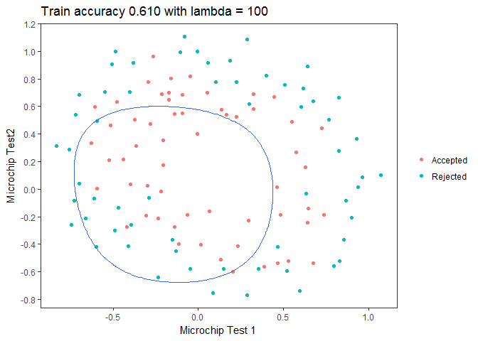

Logistic regression
================

1.Logistic regression without regularization term
=================================================

### 1.1 Visualizing the data

``` r
data = read.table("C:/Users/user/Documents/Basic-ML-with_R/data/ex2data1.txt", sep = ',')
data_plot = data

# to make ggplot represent admission result
data_plot$V3 = ifelse(data$V3 == 1, 'Admitted', 'Not admitted')

# Plotting scatter plot
library(ggplot2)
p = ggplot(data_plot, aes(V1, V2)) + geom_point(aes(color = V3))+
    ylab("Exam 2 score") + xlab("Exam 1 score") +
    scale_x_continuous(breaks = seq(30, 100, 10)) +
    scale_y_continuous(breaks = seq(30, 100, 10)) +
    theme_bw() + ggtitle("Scatter plot of training data") +
    theme(legend.title = element_blank(), 
    panel.grid.major.x =element_blank(),
    panel.grid.minor.y = element_blank(),  
    panel.grid.minor.x = element_blank(), 
    panel.grid.major.y = element_blank())   
p
```


### 1.2 Compute Cost J & Gradient

#### 1.2.1 Settings

``` r
y = data[, 3]
m = length(y)
X = cbind(rep(1, m), data[, 1:2])
X = as.matrix(X) # convert X to matrix from data.frame

# initialize parameters
initial_theta = c(rep(0, dim(X)[2]))
lambda = 0 # we don't introduce regularization term in this part.
```

#### 1.2.2 Computing the cost J(theta)

``` r
costFunction = function(X, y, lambda) {
  function(theta) {
    J = 0
    m = length(y)
    X_theta = X %*% theta # m by 1
    h = 1 / (1 + exp(-X_theta)) # m by 1
    # [-1] syntex make vector without 1st element
    reg_term = (t(theta[-1]) %*% theta[-1]) * (lambda / 2)
    J = (t(y) %*% log(h) + t(1 - y) %*% (log(1 - h)) - reg_term) / (-m)
    J
  }
}

# Computing Cost J with initial_theta
sprintf('Cost J: %.3f', costFunction(X, y, lambda)(initial_theta))
```

    ## [1] "Cost J: 0.693"

#### 1.2.3 Computing Gradient for optimization

``` r
computeGradient = function(X, y, lambda) {
  function(theta) {
    gradient = c(rep(0, dim(X)[2]))
    m = length(y)
    X_theta = X %*% theta
    h = 1 / (1 + exp(-X_theta))
    gradient = (t(X) %*% (h - y)) / m
    gradient_w_regular = gradient[-1] + ((lambda / m) * theta[-1])
    gradient = c(gradient[1], gradient_w_regular)
    gradient
  }
}

gradient = computeGradient(X, y, lambda)(initial_theta)

# Computing gradient with initial_theta
sprintf('gradient: %.3f, %.3f, %.3f: ', gradient[1], gradient[2], gradient[3])
```

    ## [1] "gradient: -0.100, -12.009, -11.263: "

### 1.3 Optimization

Learning parameters using advanced optimization algorithm In this exercise, use a built-in function (optim) to find the optimal parameters theta.

``` r
# Run optim to obtain the optimal theta
# This function will return theta and the cost
optimResult = optim(par = initial_theta,
                 fn =  costFunction(X, y, lambda),
                 gr = computeGradient(X, y, lambda), 
                 method = "BFGS", control = list(maxit = 400))
# maxit is maximum iteration

theta = optimResult$par
cost = optimResult$value

# Printing result
sprintf('cost at theta found by optim: %.3f', cost)
```

    ## [1] "cost at theta found by optim: 0.203"

``` r
sprintf('Optimized theta: %.3f %.3f %.3f:', theta[1], theta[2], theta[3])
```

    ## [1] "Optimized theta: -25.089 0.206 0.201:"

### 1.4 Plotting decision boundary

``` r
p = p + geom_abline(slope = - theta[2]/theta[3],
                    intercept = -theta[1]/theta[3], color = "blue")
p
```


### 1.5 Evaluation

After learning the parameters, you'll like to use it to predict the outcomes on unseen data.

``` r
# Predict probability for a student with score 45 on exam 1
# and score 85 on exam 2

predict_sample = t(c(1, 45, 85))
probability = 1 / (1 + exp(-predict_sample %*% theta))

sprintf('For a student with scores 45 and 85, we predict an admission probability of %.3f', probability)
```

    ## [1] "For a student with scores 45 and 85, we predict an admission probability of 0.776"

``` r
# Compute accuracy on our training set
# Make predict function first
Predict = function(X, theta) {
  m = dim(X)[1]
  p = rep(0, m)
  
  p[X %*% theta >= 0 ] = 1
  p
}  

# make predict vector  
predict = Predict(X, theta)

accuracy = mean(predict == y) * 100
sprintf('Train Accuracy: %.3f:', accuracy)
```

    ## [1] "Train Accuracy: 89.000:"

2.Regularized logistic regression
=================================

### 2.1 Visualizing the data

``` r
# Data loading
data = read.table("C:/Users/user/Documents/Basic-ML-with_R/data/ex2data2.txt", sep = ',')
data_plot = data

# to make ggplot represent QA(quality assurance) result
data_plot$V3 = ifelse(data$V3 == 1, 'Accepted', 'Rejected')


# Plotting scatter plot

p = ggplot(data_plot, aes(V1, V2)) +
  geom_point(aes(color = V3)) + ylab("Microchip Test2") +
  xlab("Microchip Test 1") + 
  scale_x_continuous(breaks = seq(-1, 1.5, 0.5)) +
  scale_y_continuous(breaks = seq(-0.8, 1.2, 0.2)) + theme_bw() +
  ggtitle("Plot of training data") +
  theme(legend.title = element_blank(),
        panel.grid.major.x =element_blank(),
        panel.grid.minor.y = element_blank(),
        panel.grid.minor.x = element_blank(),
        panel.grid.major.y = element_blank())                         
p
```


### 2.2 Feature mapping

``` r
X = data[, 1:2]
X = as.matrix(X) # convert X to matrix from data.frame

mapFeature = function(X1, X2, d) {
  degree = d
  
  output = matrix(1, length(X1), 1)
  for (i in 1:degree) {
    for (j in 0:i) {
      output = cbind(output, (X1^(i-j)) * (X2^j))
    }
  }
  output
}

# mapping the features into all polynomial terms of x1 and x2 up to the 6th power.
X = mapFeature(X[, 1], X[, 2], 6)
# X has been transformed into m by 28 matrix
y = data[, 3]
```

### 2.3 Computing Cost J

``` r
# initialize fitting parameters
initial_theta = c(rep(0,, dim(X)[2]))

# Set regularization parameter lambda to 1
lambda = 1

# Compute and display initial cost and gradient for regularized logistic
sprintf('Cost J: %.3f', costFunction(X, y, lambda)(initial_theta))
```

    ## [1] "Cost J: 0.693"

### 2.4 Optimization

``` r
# Run optim to obtain the optimal theta
# This function will return theta and the cost
# maxit is maximum iteration

optimRes = optim(par = initial_theta, fn = costFunction(X, y, lambda),
                 gr = computeGradient(X, y, lambda), 
                 method = "BFGS", control = list(maxit = 400))

# saving result
theta = optimRes$par
cost = optimRes$value

# Printing result
sprintf('cost at theta found by optim: %f', cost)
```

    ## [1] "cost at theta found by optim: 0.529003"

### 2.5 Plotting decision boundary

``` r
# Setting grid on X-Y plane and saving 'H' value on those grid 
# for using contour function

draw_boundary = function(x, y, theta, degree) {
  # make sure length(x) & length(y) have same value
  u = rep(x, times = length(x)) # grid setting
  v = rep(y, each = length(y))
  
  library(dplyr)
  cbind(u, v, z = NA) %>%  
  # with '%>%' operation we don't need to make data.frame on each step
    as.data.frame %>%
    tbl_df %>% # convert to tbl_df
    # mutate function adds column
    mutate(z = 1 / (1 +  exp(-(mapFeature(u, v, degree) %*% theta)))) 
}

# Making 'boundary' data.frame having grid and H value
boundary = draw_boundary(seq(-1, 1.5, length = 200), 
                         seq(-0.8, 1.2, length = 200), theta, 6)
```

    ## Warning: package 'dplyr' was built under R version 3.4.4

    ## 
    ## Attaching package: 'dplyr'

    ## The following objects are masked from 'package:stats':
    ## 
    ##     filter, lag

    ## The following objects are masked from 'package:base':
    ## 
    ##     intersect, setdiff, setequal, union

    ## Warning: package 'bindrcpp' was built under R version 3.4.4

``` r
# Adding contour on previous plot
p_w_decisonboundary = p + geom_contour(data = boundary, aes(x = u, y = v, z = z), breaks = 0.5) # 'breaks' provide breakpoint z level I need

p_w_decisonboundary
```


### 2.6 Regularization with various lambda

In this part, we get to try out different regularization parameters for the dataset to understand how regularization prevents overfitting

#### Case 1 (Overfitting)

lambda = 0, very small lambda

``` r
lambda1 = 0

optimRes1 = optim(par = initial_theta,
                  fn = costFunction(X, y, lambda1),
                  gr = computeGradient(X, y, lambda1),
                  method = "BFGS", control = list(maxit = 400))

# saving result
theta1 = optimRes1$par

# Making 'boundary' data.frame having grid and H value
boundary1 = draw_boundary(seq(-1, 1.5, length = 200), 
                         seq(-0.8, 1.2, length = 200), theta1, 6)

# plotting
p_w_decisonboundary1 = p +
  geom_contour(data = boundary1, aes(x = u, y = v, z = z),
               breaks = 0.5) 
p_w_decisonboundary1
```


#### Case 2 (Underfitting)

lambda = 100, very large lambda

``` r
lambda2 = 100

optimRes2 = optim(par = initial_theta,
                  fn = costFunction(X, y, lambda2),
                  gr = computeGradient(X, y, lambda2),
                  method = "BFGS", control = list(maxit = 400))

# saving result
theta2 = optimRes2$par

# Making 'boundary' data.frame having grid and H value
boundary2 = draw_boundary(seq(-1, 1.5, length = 200), 
                         seq(-0.8, 1.2, length = 200), theta2, 6)

# plotting
p_w_decisonboundary2 = p + 
  geom_contour(data = boundary2, aes(x = u, y = v, z = z),
               breaks = 0.5) 
p_w_decisonboundary2
```


