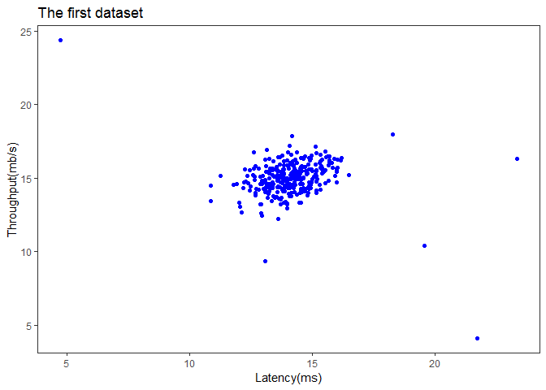

Anomaly Detection and Recommender systems
================

1.Anomaly detection
===================

In this exercise, we will implement the anomaly detection algorithm to detect anomalous behavior in server computers.

The features measure the throughput(mb/s) and latency(ms) of response of each server. We will use a Gaussian model to detect anomalous examples in our dataset. On the dataset we will fit a Gaussian distribution and then find values that have very low probability and hence can be considered anomalies.

### 1.1 Visualization

#### 1.1.1 Data loading

``` r
# Suppressing warning message
options(warn = -1)

# library for loading matlab file
library(rmatio) 
data = read.mat("C:/Users/user/Documents/Basic-ML-with_R/data/ex8data1.mat")
list2env(data, .GlobalEnv)
```

    ## <environment: R_GlobalEnv>

``` r
rm(data)
```

#### 1.1.2 Visualization

``` r
library(ggplot2)


# We should note that ggplot2 only works with data.frame
data_plot = as.data.frame(X) 

# Create plot p
p = ggplot(data_plot, aes(V1,V2)) + geom_point(color = 'blue') + 
  xlab("Latency(ms)") + ylab('Throughput(mb/s)') +
  scale_x_continuous(breaks = seq(0, 40, 5)) + 
  scale_y_continuous(breaks = seq(0, 40, 5)) + theme_bw() +
  ggtitle("The first dataset") +
  theme(legend.title = element_blank(), panel.grid.major.x = element_blank() ,
        panel.grid.minor.y = element_blank(),
        panel.grid.major.y = element_blank(),
        panel.grid.minor.x = element_blank())

# Show plot p
p  
```



### 1.2 Estimating parameters for a Gaussian distribution

To perform anomaly detection, we will first need to fit a model to the data's distribution.

We use 'estimateGaussian' function to make output an n-dimension vector 'mu' that holds the mean of all the n features and another n-dimension vector 'sigma2' that holds the variances of all the features.

Set 'estimateGaussian' function first

``` r
estimateGaussian = function(X) {
  mu = colMeans(X)
  sigma2 = apply(X, 2, var) 
  list(mu = mu, sigma2 = sigma2)
}
```

Estimate mu and sigma2

``` r
paramestimating = estimateGaussian(X)
mu = paramestimating$mu
sigma2 = paramestimating$sigma2
```

Calculate the density of the multivariate normal at each point(row) of X.

We use multivariateGaussian function to calculate density.

``` r
multivariateGaussian = function(X, mu, sigma2) {
  n = length(mu)
  m = dim(X)[1]
  
  if (is.vector(sigma2)){
    sigma2 = diag(sigma2)
  }
    
  mu_matrix = matrix(t(as.matrix(mu)), byrow = T, ncol = n, nrow = m)
  
  X_center = X - mu_matrix 
  
  denominator = ((2*pi)^(n / 2)) * (det(sigma2)^(1 / 2))
  p = exp((diag(X_center %*% solve(sigma2) %*% t(X_center)) * (-1 / 2))) / denominator
  p
}
```

Calculate density

``` r
p = multivariateGaussian(X, mu, sigma2)
```

Now, visualize the fit.

We use 'meshgrid' and 'visualizeFit' function to display(Spectial thanks to github.com/faridcher)

``` r
# loading functions
source("C:/Users/user/Documents/Basic-ML-with_R/function/meshgrid.R")
source("C:/Users/user/Documents/Basic-ML-with_R/function/visualizeFit.R")

visualizeFit(X, mu, sigma2)
```


### 1.3 Selecting the Threshold, epsilon

Now, we can investigate which examples have a very high probability given this distribution and which examples have a very low probability. The low probability examples are more likely to be the anomalies in our dataset. One way to determine which examples are anomalies is to select a threshold based on cross validation set.

In this part of exercise, we will implement an algorithm to select the threshold epsilon using F1 score on a cross validation set.

First, we make 'selectThreshold' function to return best F1 score and epsilon using given cross validation dataset.

The F1 score is computed using precision(prec) and recall(rec). F1 = (2 \* prec \* rec) / (prec + rec) prec = True Positive(tp) / (True Positive(tp) + False Positive(fp)) rec = True Positive(tp) / (True Positive(tp) + False Negative(fn))

Make selectThreshold function.

``` r
selectThreshold1 = function(yval, pval) {

  bestEpsilon = 0
  bestF1 = 0
  F1 = 0
  
  stepsize = (max(pval) - min(pval)) / 1000
  for (epsilon in seq(min(pval),max(pval),stepsize)) {

    
    tp <- sum((yval == 1) & (pval < epsilon))
    fp <- sum((yval == 0) & (pval < epsilon))
    fn <- sum((yval == 1) & (pval > epsilon))
    
    prec = tp / (tp + fp)
    rec  = tp / (tp + fn)
    
    F1 = (2 * prec * rec) / (prec + rec)
    
    if (!is.na(F1) && !is.na(bestF1) && F1 > bestF1) {
      bestF1 = F1
      bestEpsilon = epsilon
    }
  }
  list(bestEpsilon = bestEpsilon, bestF1 = bestF1)
  
}
```

Find best epsilon and F1 score

``` r
# Calculate density of multivariative Gaussian for Xval dataset
pval = multivariateGaussian(Xval, mu, sigma2)

# Using selectThreshold function, find best epsilon and F1 score
sT = selectThreshold1(yval, pval)

# Saving results
epsilon = sT$bestEpsilon
F1 = sT$bestF1

# Find the outliers in the training set using best_epsilon we found  
outliers = which(p < epsilon)
```

Visualizae the results

``` r
# Draw a red circle around those outliers
visualizeFit(X, mu, sigma2)
points(X[outliers, 1], X[outliers, 2], col = "red", lwd = 2, cex = 2)
```


### 1.4 Multidimensional Outliers

In this part, we use dataset with 11 features, capturing many more properties of your compute servers.

data loading

``` r
data1 = read.mat("C:/Users/user/Documents/Basic-ML-with_R/data/ex8data2.mat")
list2env(data1, .GlobalEnv)
```

    ## <environment: R_GlobalEnv>

``` r
rm(data1)
```

Following precess, we take similar steps that we did in previous part.

Estimate mu and sigma2

``` r
paramestimating = estimateGaussian(X)
mu = paramestimating$mu
sigma2 = paramestimating$sigma2
```

Calculate the density of the multivariate normal at each point(row) of X

``` r
p = multivariateGaussian(X, mu, sigma2)

pval = multivariateGaussian(Xval, mu, sigma2)
```

Using selectThreshold function, find best epsilon and F1 score

``` r
sT = selectThreshold1(yval, pval)

# Saving results
epsilon = sT$bestEpsilon
F1 = sT$bestF1

# Find the outliers in the training set using best_epsilon we found  
outliers = which(p < epsilon)

# Show results
sprintf('best threshold: %e', epsilon)
```

    ## [1] "best threshold: 1.371661e-18"

``` r
sprintf('number of anomalies: %.f', length(outliers))
```

    ## [1] "number of anomalies: 117"
